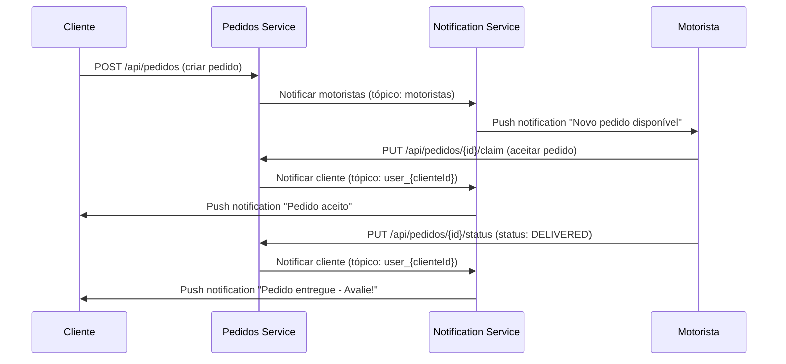

# Pedidos Service

Microserviço responsável por gerenciar pedidos de entrega e integração com o serviço de notificações.

## Funcionalidades

### Principais Endpoints

- **POST** `/api/pedidos` - Criar novo pedido (notifica motoristas)
- **GET** `/api/pedidos/{id}` - Buscar pedido por ID
- **GET** `/api/pedidos/cliente/{email}` - Buscar pedidos por email do cliente
- **GET** `/api/pedidos/cliente/id/{clienteId}` - Buscar pedidos por ID do cliente
- **GET** `/api/pedidos/motorista/{motoristaId}` - Buscar pedidos por motorista
- **GET** `/api/pedidos/available` - Listar pedidos disponíveis
- **GET** `/api/pedidos/status/{status}` - Filtrar pedidos por status
- **PUT** `/api/pedidos/{id}/status` - Atualizar status do pedido (notifica cliente quando entregue)
- **PUT** `/api/pedidos/{id}/claim` - Motorista reivindicar pedido (notifica cliente)
- **DELETE** `/api/pedidos/{id}` - Excluir pedido

### Integração com Notification Service

O serviço automaticamente envia notificações em momentos específicos do ciclo de vida dos pedidos:

#### 1. **Criação de Pedido** (`POST /api/pedidos`)
- **Evento**: Novo pedido criado pelo cliente
- **Notificação**: Enviada para **todos os motoristas** via tópico `motoristas`
- **Conteúdo**: Informações sobre nova entrega disponível

#### 2. **Pedido Aceito** (`PUT /api/pedidos/{id}/claim`)
- **Evento**: Motorista aceita um pedido
- **Notificação**: Enviada para o **cliente específico** via tópico `user_{clienteId}`
- **Conteúdo**: Confirmação de que pedido foi aceito e motorista está a caminho

#### 3. **Pedido Finalizado** (`PUT /api/pedidos/{id}/status` com status `DELIVERED`)
- **Evento**: Status do pedido alterado para "DELIVERED"
- **Notificação**: Enviada para o **cliente específico** via tópico `user_{clienteId}`
- **Conteúdo**: Confirmação de entrega e solicitação de avaliação

### Configuração

#### Variáveis de Ambiente

```bash
# Database
DB_HOST=
DB_PORT=
DB_NAME=
DB_USERNAME=
DB_PASSWORD=

# Notification Service Integration
NOTIFICATION_SERVICE_URL=http://localhost:8084
```

#### Prerequisitos

- Java 17+
- PostgreSQL 13+
- Maven 3.8+
- **Notification Service** rodando (para envio de notificações)

### Execução

#### Local

```bash
# Compilar o projeto
mvn clean compile

# Executar os testes
mvn test

# Iniciar o serviço
mvn spring-boot:run
```

O serviço estará disponível na porta **8082**.

### Integração com Outros Serviços

Este serviço se integra com:

1. **Notification Service** - Para envio de notificações automáticas (OBRIGATÓRIO para notificações)
2. **Authentication Service** - Para validação de tokens JWT
3. **Rastreamento Service** - Para atualizações de localização

### ⚠️ Ordem de Inicialização

**IMPORTANTE**: Para que as notificações funcionem corretamente:

```bash
# 1. Primeiro, inicie o Authentication Service
cd backend/autenticacao
mvn spring-boot:run

# 2. Em seguida, inicie o Notification Service  
cd backend/notificacao
mvn spring-boot:run

# 3. Por último, inicie o Pedidos Service
cd backend/pedidos
mvn spring-boot:run
```

### API Documentation

Após iniciar o serviço, a documentação estará disponível em:
- **Swagger UI**: http://localhost:8082/api/pedidos/swagger-ui.html
- **OpenAPI JSON**: http://localhost:8082/api/pedidos/api-docs

### Status dos Pedidos

- `PENDING` - Pedido criado, aguardando motorista
- `ACCEPTED` - Pedido aceito por motorista
- `IN_TRANSIT` - Pedido em trânsito
- `OUT_FOR_DELIVERY` - Saiu para entrega
- `DELIVERED` - Pedido entregue (trigga notificação de avaliação)
- `CANCELLED` - Pedido cancelado
- `FAILED` - Pedido falhou

### Fluxo de Notificações



### Tratamento de Erros

- Notificações são enviadas de forma **assíncrona** e **não-bloqueante**
- Falhas de notificação **não impedem** o funcionamento do pedido
- Logs são gerados para auditoria de notificações
- Se o Notification Service estiver indisponível, o sistema continua funcionando normalmente